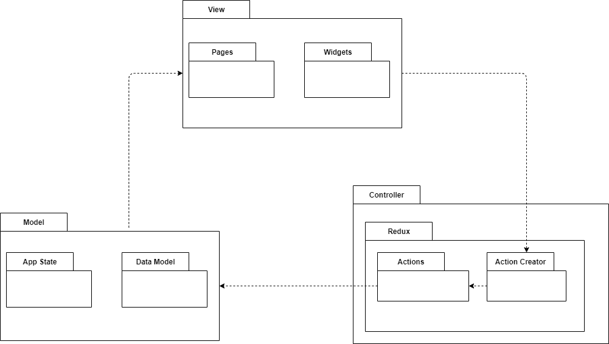
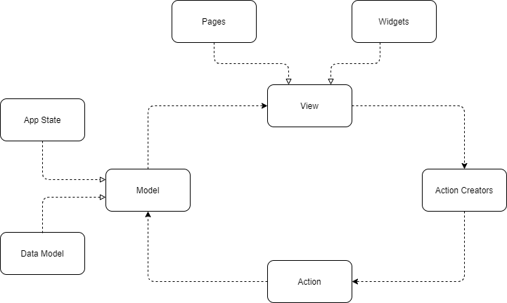
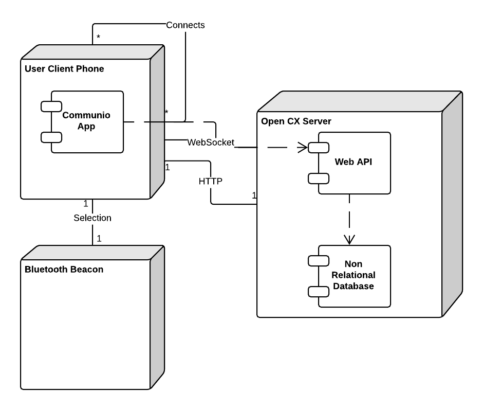

# openCX-*Monkey Type Beat* Development Report

This project is based on the product of [open-cx-heapsdontlie](https://github.com/softeng-feup/open-cx-heapsdontlie).

Welcome to the documentation pages of the *Commun.io* of **openCX**!

You can find here detailed about the (sub)product, hereby mentioned as module, from a high-level vision to low-level implementation decisions, a kind of Software Development Report (see [template](https://github.com/softeng-feup/open-cx/blob/master/docs/templates/Development-Report.md)), organized by discipline (as of RUP):

* Business modeling
  * [Product Vision](#Product-Vision)
  * [Elevator Pitch](#Elevator-Pitch)
* Requirements
  * [Use Case Diagram](#Use-case-diagram)
  * [User stories](#User-stories)
  * [Domain model](#Domain-model)
* Architecture and Design
  * [Logical architecture](#Logical-architecture)
  * [Physical architecture](#Physical-architecture)
  * [Prototype](#Prototype)
* [Implementation](#Implementation)
* [Test](#Test)
* [Configuration and change management](#Configuration-and-change-management)
* [Project management](#Project-management)

So far, contributions are exclusively made by the initial team, but we hope to open them to the community, in all areas and topics: requirements, technologies, development, experimentation, testing, etc.

Please contact us!

Thank you!

Developers:
* André Mamprin Mori (up201700493@fe.up.pt)
* Diogo Miguel Borges Gomes (up201806572@fe.up.pt)
* João Pedro da Costa Ribeiro (up201704851@fe.up.pt)
* Luís Paulo da Rocha Miranda (up201306340@fe.up.pt)
* Pedro Santos Pedroso de Lima (up201605125@fe.up.pt)

---

## Product Vision

Our App aims to:

- Provide one to one social media exchange

- Allow the broadcast of social media information

- Permit the filtering of incoming data based on defined preferences


It is directed towards:

- Conference attendees seeking to expand their network

- Recruiters looking for specialized people

- Communities intending to broaden their audience

The atendees will benefit from maximizing their networking opportunities, as they will be equipped with the means to easily exchange their social media information.

Conferences, on the other hand, will profit from their now enhanced ability to form a densely connected community out of their audience, at a very small cost to themselves.

---
## Elevator Pitch
Ever felt like you lose contact with every awesome person you meet during a conference? Ever felt like it is impossible for you to find the people whose interests are shared with you? Commun.io has a solution for you! Have the ability to find those close to you whom you can share your thoughts. Commun.io - networking from the comfort of your pocket

---
## Requirements

Want to contribute to this project? Here are some requirements you will need!
 - Flutter
 - Dart
 - OpenCX Server - you can use ours at https://open-cx-communio.herokuapp.com/

Add a .env file at the root of the communio with the following information
```
API_URL=https://open-cx-communio.herokuapp.com/
```

### Use case diagram

<div align="center">
  
</div>

### User stories

Our current User Stories are in our [Trello](https://trello.com/b/Kat9JPpt) and each card contains a mockup for the User Story.


### Domain model

Since we based our work around the previous app's version, we think the existing domain model still applies to the most recent release. Therefore we decided to keep it identical.

<div align="center">
  
</div>


---

## Architecture and Design
### Logical Architecture

Like the original project, the application uses a MVC architecture where the controller as the works with the aid of a redux implementation. The use of this implementation facilitates the app's state transitions.

<div align="center">
    
</div>

### Physical architecture

#### Component diagram
<div align="center">
    
</div>

#### Deployment Diagram

There were no changes on the original Deployment Diagram from the first implementation.



## Implementation

### v0.1 - 06/11/2020

* Initial version of the report
* Fixed flutter and flutter-packages version conflicts coming from the previous implementation of the project
* First version of the homepage implemented


### [v0.2](https://github.com/FEUP-ESOF-2020-21/open-cx-t5g3-monkey-type-beat/releases/tag/v0.2) - 20/11/2020

* User's profile page now displaying properly
* Implemented filter removing
* Added more useful data from the database to the Home page

### [v0.3](https://github.com/FEUP-ESOF-2020-21/open-cx-t5g3-monkey-type-beat/releases/tag/v0.3) - 04/12/2020

* The user can now create a new profile
* Friends page now accessible without friends interests being removable by the user
* Profile page interests now removable
* Solved small issues on previously implemented user story (filter removing) which was not working as it should


### [v0.4]() - 18/12/2020

* Final version of the report
* Delete account feature added
* Login and logout implemented

---
## Test

### Test Plan

In order to test this app, we planned to use flutter gherkin to develop acceptance tests and unit tests.

Despite trying, we failed to implement tests for the features we wanted to, because of the lack of time.

The following tests were planned to be implemented for this "Delete Account" User Story:

• Given a user that is already signed up, then it is possible for them to go to the settings page and choose to delete their account and a form pops up to confirm its deletion.

• Given a user that chooses to delete their account, then it is possible for them to confirm that action and a message pops up verifying the deletion.

• Given a user that chooses to delete their account, then it is possible for them to cancel that action and make the form disappear without any further action.


### Test Case Specification

The acceptance tests mentioned were added to the respective user story card.

---

## Project management

We used [Trello](https://trello.com/b/Kat9JPpt) to manage our project by using the board to assign tasks to each member.

