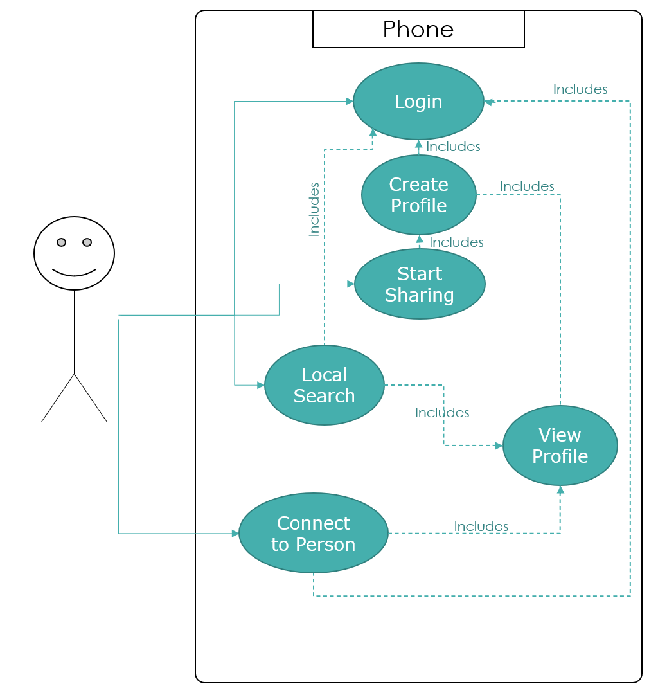
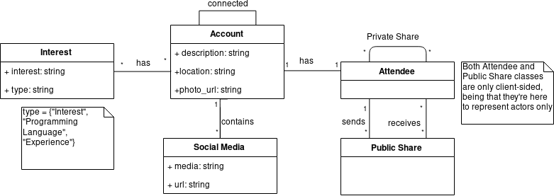

# openCX-*Monkey Type Beat* Development Report

This project is based on the product of [open-cx-heapsdontlie](https://github.com/softeng-feup/open-cx-heapsdontlie).

Welcome to the documentation pages of the *Commun.io* of **openCX**!

You can find here detailed about the (sub)product, hereby mentioned as module, from a high-level vision to low-level implementation decisions, a kind of Software Development Report (see [template](https://github.com/softeng-feup/open-cx/blob/master/docs/templates/Development-Report.md)), organized by discipline (as of RUP):

* Business modeling
  * [Product Vision](#Product-Vision)
  * [Elevator Pitch](#Elevator-Pitch)
* Requirements
  * [Use Case Diagram](#Use-case-diagram)
  * [User stories](#User-stories)
  * [Domain model](#Domain-model)
* Architecture and Design
  * [Logical architecture](#Logical-architecture)
  * [Physical architecture](#Physical-architecture)
  * [Prototype](#Prototype)
* [Implementation](#Implementation)
* [Test](#Test)
* [Configuration and change management](#Configuration-and-change-management)
* [Project management](#Project-management)

So far, contributions are exclusively made by the initial team, but we hope to open them to the community, in all areas and topics: requirements, technologies, development, experimentation, testing, etc.

Please contact us!

Thank you!

Developers:
* André Mamprin Mori (up201700493@fe.up.pt)
* Diogo Miguel Borges Gomes (up201806572@fe.up.pt)
* João Pedro da Costa Ribeiro (up201704851@fe.up.pt)
* Luís Paulo da Rocha Miranda (up201306340@fe.up.pt)
* Pedro Santos Pedroso de Lima (up201605125@fe.up.pt)

---

## Product Vision

Our App aims to:

- Provide one to one social media exchange

- Allow the broadcast of social media information

- Permit the filtering of incoming data based on defined preferences


It is directed towards:

- Conference attendees seeking to expand their network

- Recruiters looking for specialized people

- Communities intending to broaden their audience

The atendees will benefit from maximizing their networking opportunities, as they will be equipped with the means to easily exchange their social media information.

Conferences, on the other hand, will profit from their now enhanced ability to form a densely connected community out of their audience, at a very small cost to themselves.

---
## Elevator Pitch
Ever felt like you lose contact with every awesome person you meet during a conference? Ever felt like it is impossible for you to find the people whose interests are shared with you? Commun.io has a solution for you! Have the ability to find those close to you whom you can share your thoughts. Commun.io - networking from the comfort of your pocket

---
## Requirements

Want to contribute to this project? Here are some requirements you will need!
 - Flutter
 - Dart
 - OpenCX Server - you can use ours at https://open-cx-communio.herokuapp.com/

Add a .env file at the root of the communio with the following information
```
API_URL=https://open-cx-communio.herokuapp.com/
```

### Use case diagram

<div align="center">
  
</div>

### User stories

Our current User Stories are in our [Trello](https://trello.com/b/Kat9JPpt).


### Domain model

<div align="center">
  
</div>


---

## Architecture and Design
The architecture of a software system encompasses the set of key decisions about its overall organization.

A well written architecture document is brief but reduces the amount of time it takes new programmers to a project to understand the code to feel able to make modifications and enhancements.

To document the architecture requires describing the decomposition of the system in their parts (high-level components) and the key behaviors and collaborations between them.

In this section you should start by briefly describing the overall components of the project and their interrelations. You should also describe how you solved typical problems you may have encountered, pointing to well-known architectural and design patterns, if applicable.

### Logical architecture
The purpose of this subsection is to document the high-level logical structure of the code, using a UML diagram with logical packages, without the worry of allocating to components, processes or machines.

It can be beneficial to present the system both in a horizontal or vertical decomposition:
* horizontal decomposition may define layers and implementation concepts, such as the user interface, business logic and concepts;
* vertical decomposition can define a hierarchy of subsystems that cover all layers of implementation.

### Physical architecture
The goal of this subsection is to document the high-level physical structure of the software system (machines, connections, software components installed, and their dependencies) using UML deployment diagrams or component diagrams (separate or integrated), showing the physical structure of the system.

It should describe also the technologies considered and justify the selections made. Examples of technologies relevant for openCX are, for example, frameworks for mobile applications (Flutter vs ReactNative vs ...), languages to program with microbit, and communication with things (beacons, sensors, etc.).

### Prototype
To help on validating all the architectural, design and technological decisions made, we usually implement a vertical prototype, a thin vertical slice of the system.

In this subsection please describe in more detail which, and how, user(s) story(ies) were implemented.

---

## Implementation
Regular product increments are a good practice of product management.

While not necessary, sometimes it might be useful to explain a few aspects of the code that have the greatest potential to confuse software engineers about how it works. Since the code should speak by itself, try to keep this section as short and simple as possible.

Use cross-links to the code repository and only embed real fragments of code when strictly needed, since they tend to become outdated very soon.

---
## Test

There are several ways of documenting testing activities, and quality assurance in general, being the most common: a strategy, a plan, test case specifications, and test checklists.

In this section it is only expected to include the following:
* test plan describing the list of features to be tested and the testing methods and tools;
* test case specifications to verify the functionalities, using unit tests and acceptance tests.

A good practice is to simplify this, avoiding repetitions, and automating the testing actions as much as possible.

---
## Configuration and change management

Configuration and change management are key activities to control change to, and maintain the integrity of, a project’s artifacts (code, models, documents).

For the purpose of ESOF, we will use a very simple approach, just to manage feature requests, bug fixes, and improvements, using GitHub issues and following the [GitHub flow](https://guides.github.com/introduction/flow/).


---

## Project management

Software project management is an art and science of planning and leading software projects, in which software projects are planned, implemented, monitored and controlled.

In the context of ESOF, we expect that each team adopts a project management tool capable of registering tasks, assign tasks to people, add estimations to tasks, monitor tasks progress, and therefore being able to track their projects.

Example of tools to do this are:
  * [Trello.com](https://trello.com)
  * [Github Projects](https://github.com/features/project-management/com)
  * [Pivotal Tracker](https://www.pivotaltracker.com)
  * [Jira](https://www.atlassian.com/software/jira)

We recommend to use the simplest tool that can possibly work for the team.
